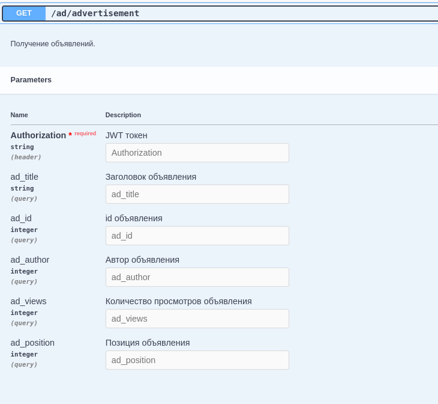
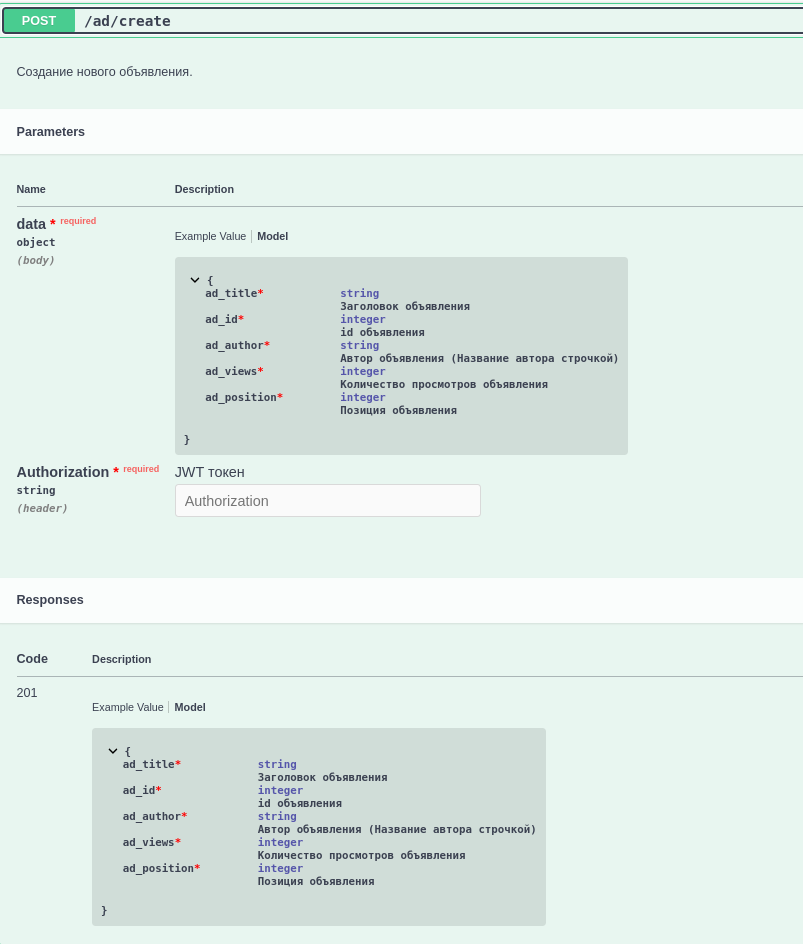
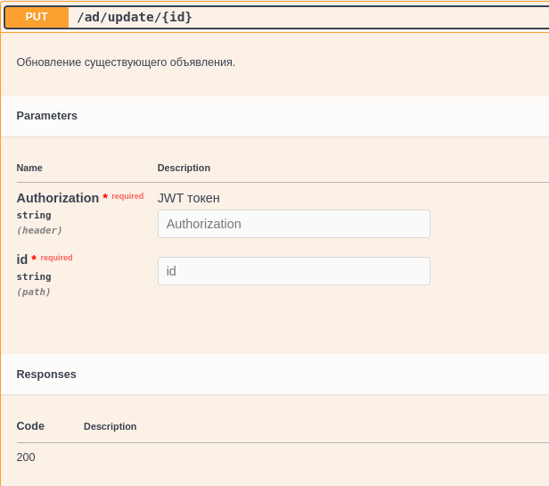
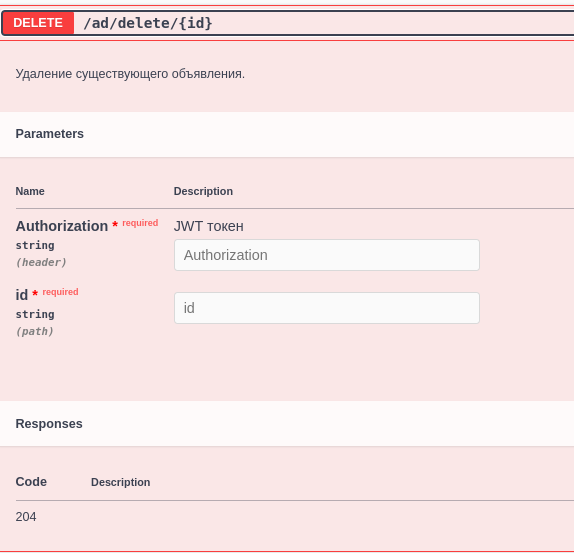

# Описание
__API по объявлениям.__
## Функционал
```
* GET запрос. Можно получить информацию по объявлению.
* POST запрос. Можно добавить объявление.
* PUT запрос. Можно обновить информацию по объявлению.
* DELETE запрос. Можно удалить объявление.

* Более подробную информацию можно найти в документации к API.
по эндпоинту localhost/swagger.
```




```
Регистрация и аутентификация:
Регистрация реализована по эндпоинту api/v1/user/create. Телом запроса необходимо передать юзернейм и пароль.
Далее, после успешной регистрации, необходимо получить JWT токен, сделать это можно по эндпоинту:
/user/auth/jwt/create/
В ответ вам придет пара ключей, access и refresh токены (Токены живут 1 и 2 дня соответственно).
При запросе к API в Headers необходимо прописать:
Authorization: JWT <acess_token>
Для обновления токена необходимо сделать запрос на /user/auth/jwt/refresh/
Более подробная документация доступна по эндпоинту <localhost>/swagger.
```
## Подготовка и запуск проекта
#### Клонирование репозитория
```
Склонируйте репозиторий на локальную машину:
```
```bash
git clone https://github.com/sixscale/api_it_solutions.git
```
#### Подготовка базы данных PostgreSQL
##### Шаг 1. Скачайте и установите PostreSQL 14.5
```
https://www.enterprisedb.com/downloads/postgres-postgresql-downloads
```
##### Шаг 2. Запустите PostgreSQL и создайте БД
#### Настройка виртуального окружения и проведение миграций
##### Шаг 1. Установка виртуального окружения Poetry
```
Откройте терминал.
Скопируйте и выполните следующую команду:
```
```bash
curl -sSL https://install.python-poetry.org | python3 -
```
```
Если после установки вы не можете запустить poetry, возможно, он не добавлен в переменную среды PATH.
Убедитесь, что путь к директории с установленным Poetry добавлен в ваше окружение.
Сайт Poetry с гайдом по установке: https://python-poetry.org/docs/#installation
Обычно это:
Linux и macOS: ~/.local/bin
Windows: %USERPROFILE%\.local\bin или %USERPROFILE%\AppData\Roaming\Python\PythonXY\Scripts 
(где XY - ваша версия Python)
Для Linux и macOS добавьте следующую строчку в ваш ~/.bashrc, ~/.bash_profile или ~/.zshrc:
```
```bash
export PATH="$HOME/.local/bin:$PATH"
```
```
Перейдите в директорию проекта.
Скопируйте и выполните следующую команду:
```
```bash
cd <path_to_project/>api_it_solutions/
```
##### Шаг 2. Установка зависимостей проекта
```
Установите зависимости.
Скопируйте и выполните следующую команду:
```
```bash
poetry install
```
##### Шаг 3. Активация виртуального окружения
```
Активируйте виртуальное окружение.
Скопируйте и выполните следующую команду:
```
```bash
poetry shell
```
##### Шаг 4. Перейдите в директорию с файлом manage.py с запущенным виртуальным окружением
```bash
cd <path_to_project>/api_it_solutions/src/
```
##### Шаг 7. Проведение миграции
```bash
poetry run python manage.py makemigrations
poetry run python manage.py migrate
```
#### Подготовка переменных окружения
##### Шаг 1. Перейдите в директорию проекта
```bash
cd <path_to_project>/api_it_solutions
```

##### Шаг 2. Откройте файл *env_example* 
```bash
nano env_example
```
```
Можно так же использовать vim или emacs.
Внутри файла поменяйте все переменные окружения на свои.
И переимуйте файл в .env
```
#### Перенос данных из фикстур в базу данных
```
В проекту создана папка fixtures. В ней собраны 10 объявлений и авторы.
Это сделано, чтобы можно было сразу воссоздать базу данных.
```
```
Для того, чтобы выгрузить данные в базу дынных необходимо прописать две команды.
необходимо находиться в директории <path_to_project>/api_it_solutions/src/
```
```bash
poetry run python manage.py load_data_author
```
```bash
poetry run python manage.py load_data_ad
```
#### Запуск проекта на локальной машине
```bash
poetry run python manage.py runserver
```
## Используемый стек
```
Python, Django, DRF, PostgreSQL, Simple-JWT
```
#### Также используется
```
django-filter, psycopg2-binary, Poetry
```